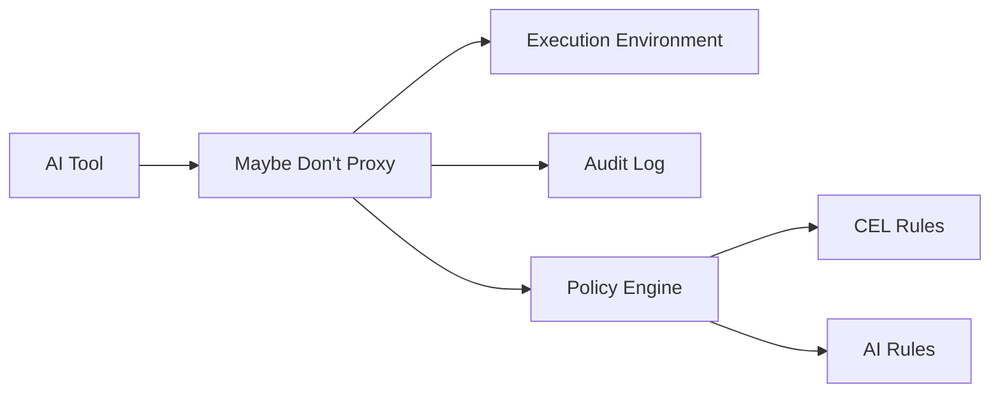

# Architecture

This document describes the high-level architecture of Maybe Don't.

## Overview

Maybe Don't is a security proxy that sits between AI tools and their execution environment. It provides policy-based validation and audit logging for tool calls.

## Components

### 1. Server Layer

The server layer handles incoming requests and supports multiple protocols:

- **HTTP Server**: Standard HTTP/HTTPS server for REST API endpoints
- **SSE Server**: Server-Sent Events for streaming responses
- **STDIO Server**: Standard input/output for CLI integration

### 2. Authentication Layer

The authentication layer validates incoming requests using:

- API Key authentication
- JWT (JSON Web Token) validation
- mTLS (mutual TLS) verification

### 3. Policy Engine

The policy engine evaluates tool calls against defined rules:

#### CEL Engine
- Uses Google's Common Expression Language
- Evaluates rules in parallel
- Supports custom functions for safe field access
- Provides deterministic results

#### AI Engine
- Uses OpenAI's GPT models
- Evaluates rules in parallel
- Provides contextual analysis
- Supports natural language rules

### 4. Validation Chain

The validation chain processes tool calls through multiple stages:

1. Request parsing
2. Authentication
3. Policy evaluation
4. Response generation
5. Audit logging

### 5. Audit System

The audit system logs all tool calls and their outcomes:

- JSON or text format
- Structured logging
- Policy evaluation results
- Request/response details

## Data Flow

1. **Request Reception**
   - Tool call received by server
   - Request parsed and validated

2. **Authentication**
   - Request authenticated
   - Identity verified

3. **Policy Evaluation**
   - CEL rules evaluated
   - AI rules evaluated
   - Results combined

4. **Response Generation**
   - Success/failure determined
   - Response formatted
   - Error details included

5. **Audit Logging**
   - Event logged
   - Results recorded
   - Metadata captured

## Configuration

The system is configured through:

- YAML configuration files
- Environment variables
- Command-line flags

## Security Considerations

- No sensitive data stored
- Secure by default
- Minimal attack surface
- Regular security updates

## Performance

- Parallel policy evaluation
- Efficient request handling
- Minimal latency
- Resource optimization

## Extensibility

The system can be extended through:

- Custom CEL functions
- New server types
- Additional authentication methods
- Custom policy rules 